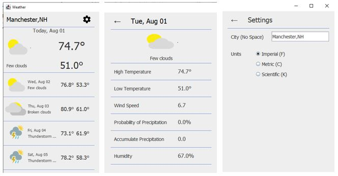
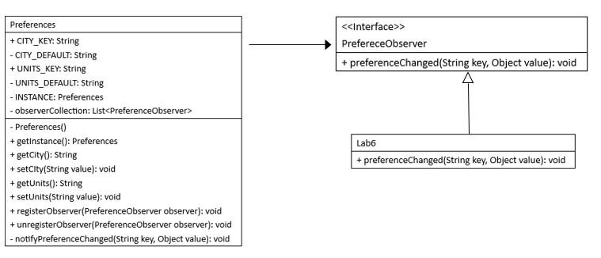

# Lab6: Weather Forecast Part 2

- The left view (the main view) shows the 5-day forecast.
- The middle view shows the detailed forecast of the day clicked on the main view.
- The right view shows the settings. You can change the city and units.

## Objectives

- Learn how to use and implement Observer Design Pattern.
- Introduce the Loose Coupling Principle.

## Work

1. :computer: **Update the API key in `WeatherAPI.java`.**
2. Review the Settings screen in the Design view of `Lab6.java` and find how to change the view from the main screen to the settings screen.
3. `PreferenceObserver` is defined as an interface. It is implemented by the `Lab6` class, which overrides `preferenceChanged()`. 
4. :computer: **Complete the body of `preferenceChanged()` in the `Lab6` class.**
5. The `Preferences` class is defined with the singleton design pattern to make sure that there is only one instance of `Preferences`. It includes `registerObserver()` to register an observer and `unregisterObserver()` to unregister an observer.
6. The `Preferences` class also defines `notifyPreferenceChanged()`, which is called by `setCity()` and `setUnits()`. 
7. :computer: **Complete the body of the `notifyPreferenceChanged()` method in the `Preferences` class.**

    

---
End of Lab6

